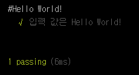

## Step 01. Hello World!

새로운 기술. 프로그램 언어를 입력할 때에는 항상 나타나는 _Hello World_.
`mocha`의 가장 기초 코드와는 거리가 멀지만 그래도 *Hello World*를 고집해 보겠습니다.
[mocha를 설치하는 방법](https://github.com/kdydesign/Mocha-Tutorial)에서 이미 `Mocha_test`라는 폴더를 만들어 놓았습니다.

해당 폴더에 `test.js`를 생성하여 아래와 같이 작성합니다.

```javascript
var assert = require('assert');

describe('#Hello World!', function () {
    it('입력 값은 Hello World!', function () {
        var input = 'Hello World!'; // 입력 값이라고 가정

        assert.equal('Hello World!', input);
    });
});
```

위 코드는 `mocha`의 가장 기본 코드입니다.
mocha는 `describe()`와 `it()`으로 테스트 스위트와 유닛 테스트를 정의하고 실행합니다.
mocha는 `BDD` 스타일을 기본으로하고 있지만 `TDD` 스타일도 지원을 하고 있습니다.
해당 강좌에서는 위와 같이 `BDD` 스타일로 작성하도록 하겠습니다.

### Assertion
`mocha`의 장점 중인 하나가 Assertion 라이브러리와 독립적으로 사용이 가능하다는 것입니다. 즉, _mocha는 어떠한 Assertion 라이브러리라도 가져다가 같이 사용할 수 있습니다._
대게 `mocha`는 `chai`라는 Assertion 라리브러리와 같이 사용합니다. 위 코드에서는 Node.js에서 제공하는 기본 Assetion 라이브러리를 사용하였습니다.


- - - 


이제 위에서 생성한 `test.js`를 실행해 보도록 하겠습니다. 해당 경로에서 `mocha`를 실행합니다.
```
$ mocha
```
기본적으로 mocha 실행 시 test.js 파일을 실행합니다. 하지만 특정 파일도 실행이 가능합니다.
```
$ mocha test.js
```

`1 passing`으로 통과되었다는 뜻입니다.

