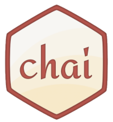

# Step 02. Chai 사용하기.

[Step 01](https://github.com/kdydesign/Mocha-Tutorial/tree/master/step01-Hello%20World!)에서는 기본적인 `mocha` 사용법에 대해 알아보았습니다.
이번 Step 02에서는 [Step 01](https://github.com/kdydesign/Mocha-Tutorial/tree/master/step01-Hello%20World!)에서 언급한 `Assertion` 라이브러리에 대해
어떻게 사용하는지와 어떤 것인지를 알아보도록 하겠습니다.


## Chai.


[mochjs.org](https://mochajs.org/)에서 리스팅 된 `Assertion`에는 `Should.js`, `expect.js`, `chai`, `better-assert`, `unexpected` 가 있습니다.
이 중 어떤 `Assertion`를 사용하는지는 사용자의 판단입니다. 궁극적으로는 같은 목적을 가지기 때문에 어떤 스타일을 선호하냐는 것에 따라 나뉠 수 있습니다.
<br/>
대게 `mocha`는 `chai`와 같이 사용이 되며, 
[NPM COMAPRE](https://npmcompare.com/compare/chai,expect,should)를 참고로 보았을 때도 `chai`가 다른 `Assertion` 보다 선호하는 것을 볼 수 있습니다.
<br/>

먼저 `chai`는 Node.js 기반의 `Assertion` 라이브러리로 `BDD`와 `TDD` 스타일을 지원하고 있으며, 지원하는 아래와 같은 인터페이스를 지원합니다.
> * **Should**
> * **Expect**
> * **Assert**


## Chai 설치하기.

`npm`을 통해 `chai`를 설치합니다. 어렵지 않아요~
```
$ npm i chai --save-dev
```
