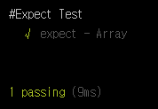
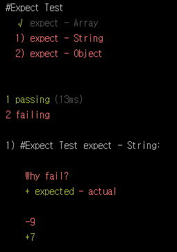

# Step 02. Assertion - Chai

[Step 01: Hello World!](https://github.com/kdydesign/Mocha-Tutorial/tree/master/step01-Hello%20World!)에서는 기본적인 `mocha` 사용법에 대해 알아보았습니다.
이번 Step 02에서는 [Step 01: Hello World!](https://github.com/kdydesign/Mocha-Tutorial/tree/master/step01-Hello%20World!)에서 언급한 `Assertion` 라이브러리에 대해
어떻게 사용하는지와 어떤 것인지를 알아보도록 하겠습니다.


## Chai.

<p align="center">
  
</p>

[mochjs.org](https://mochajs.org/)에서 리스팅 된 `Assertion`에는 `Should.js`, `expect.js`, `chai`, `better-assert`, `unexpected` 가 있습니다.
이 중 어떤 `Assertion`를 사용하는지는 사용자의 판단입니다. 궁극적으로는 같은 목적을 가지기 때문에 어떤 스타일을 선호하냐는 것에 따라 나뉠 수 있습니다.
<br/>
대게 `mocha`는 `chai`와 같이 사용되며, 
[NPM COMAPRE](https://npmcompare.com/compare/chai,expect,should)를 참고로 보았을 때도 `chai`가 다른 `Assertion` 보다 선호하는 것을 볼 수 있습니다.
<br/>

먼저 `chai`는 Node.js 기반의 `Assertion` 라이브러리로 `BDD`와 `TDD` 스타일을 지원하고 있으며, 지원하는 아래와 같은 인터페이스를 지원합니다.
> * **Should**
> * **Expect**
> * **Assert**


## Chai 설치하기.

먼저 `npm`을 통해 `chai`를 설치합니다.
```sh
$ npm i chai --save-dev
```
설치는 끝입니다. 쉽죠? :)
<br/> 
너무 간단해서 `Chai 설치하기.` 란 부제를 지워버리고 싶을 정도지만 그래도 Tutorial이니 삭제하지는 않겠습니다.


## Chai 사용하기.

우리는 이제 `chai`까지 설치를 하였습니다. 이렇게 설치한 `chai`를 불러와서 사용하기만 하면 됩니다. [Step 01: Hello World!](https://github.com/kdydesign/Mocha-Tutorial/tree/master/step01-Hello%20World!)에서 이미 `test.js`파일을 생성했으니 새롭게 `test-chai.js`라는 파일을 생성합니다.
그리고 아래처럼 코드를 입력해주세요.

```javascript
var chai = require('chai');
var expect = chai.expect;
var assert = chai.assert;
var should = chai.should();
```

`require`를 통해 `chai` 모듈을 사용하기로 합니다. 그런데 그 아래를 보니 `expect`, `assert`, `should`가 체이닝을 통해 불러왔습니다.
위에서 먼저 설명을 했지만 `chai`는 이 스타일들을 지원을 하기때문에 사용할 수가 있는 것이죠. 굳이 저 3개를 모두 사용할 필요는 없습니다.
어떤 것을 사용해야 하는지 모르겠다면 각각의 API를 보고 마음에 드는 것을 사용하기로 합니다. 왜냐하면 `Assertion`이기 때문이죠. (전 그렇게 생각..)

이제 테스트 스위트를 작성해보겠습니다.


### expect

```javascript
var chai = require('chai');
var expect = chai.expect;
var assert = chai.assert;
var should = chai.should();

describe('#Expect Test', function () {
    it('expect - Array', function () {
        var arr = [1, 2, 5, 3, 4];

        expect(arr).to.have.lengthOf(5);                        //array length
        expect(arr).to.be.not.empty;                            //empty
        expect(arr).to.have.ordered.members([1, 2, 5, 3, 4]);   //arr === members
    });
});
```

간단하군요. 실행해 보겠습니다.

```
$ mocha test-chai.js
```



정상적으로 출력이 되는 것을 확인할 수 있습니다.
<br/>

위 예제는 `expect`를 사용한 코드입니다. `expect`는 `BDD Style`의 인터페이스이며, 자연어에 가까운 `Assertion`입니다. 아직 감이 안 오시나요? 다른 코드를 보겠습니다.
이어서 코딩해 주시면 됩니다.

```javascript
it('expect - String', function () {
    var str = 'Awesome!!';
    
    expect(str).to.be.a('String');                  //str type
    expect(str).to.equal('Awesome!!');              //str === 'Awesome!!'
    expect(str).to.have.lengthOf(7, 'Why fail?');   //Error
});

it('expect - Object', function () {
    var obj = {
        assertion: ['assert', 'expect', 'should'],
        framework: 'mocha'
    };

    expect(obj).to.have.property('assertion').with.lengthOf(3);     //assertion value length
    expect(obj).to.have.all.keys('framework', 'assertion');         //obj key === keys
});
```

위 예제에서 주목할 만한 곳은 아래 코드입니다.

```javaScript
expect(str).to.have.lengthOf(7, 'Why fail?');
```

`expect`는 임의의 실패한 `assertion` 앞에 메시지를 포함할 수 있습니다. 예제를 실행해 보면 아래와 같이 실패한 결과에 메시지가 출력되는 것을 볼 수 있습니다.




처음 접할 때는 다소 생소할 수 있습니다. 하지만 걱정하세요. 잘 정리된 [expect API](http://chaijs.com/api/bdd/)가 있으니까요.
<br/>
`expect api`에 리스팅 되어 있는 체이닝입니다. 이 체이닝은 뒤에 있을 `should`에서도 같은 방식을 사용하고 있습니다.

> * to
> * be
> * been
> * that
> * which
> * and
> * has
> * have
> * with
> * at
> * of
> * same
> * but
> * does

코드에 대한 설명은 주석을 참고하세요.


### should

위에서 언급했지만 `should`는 `expect`와 같은 체이닝 방식을 사용합니다. 
`should`는 `IE`와 사용할 때 몇 가지의 문제가 있으므로 브라우저 호환성을 알고 있어야 합니다.
<br/>
자, 그럼 이제 예제를 통해 `should`와 `expect`가 어떻게 같은 체이닝 방식을 사용하는지 확인해 보겠습니다.
<br/>
새로운 테스트 스위트 `#Should Test`를 추가하겠습니다.

```javascript
describe('#Should Test', function () {
    it('should - Array', function () {
        var arr = [1, 2, 5, 3, 4];

        arr.should.have.lengthOf(5);                        //array length
        arr.should.be.not.empty;                            //empty
        arr.should.have.ordered.members([1, 2, 5, 3, 4]);   //arr === members
    });

    it('should - String', function () {
        var str = 'Awesome!!';

        str.should.be.a('String');                  //str type
        str.should.equal('Awesome!!');              //str === 'Awesome!!'
        str.should.have.lengthOf(7, 'Why fail?');   //Error
    });

    it('should - Object', function () {
        var obj = {
            assertion: ['assert', 'expect', 'should'],
            framework: 'mocha'
        };

        obj.should.have.property('assertion').with.lengthOf(3);     //assertion value length
        obj.should.have.all.keys('framework', 'assertion');         //obj key === keys
    });
});
```
결과는 `expect`와 같습니다. 두 코드를 비교해 보면 어느 부분이 다른지 명확하게 보입니다. 거의 다른 부분이 없죠.
<br/>
그럼 `expect`와 `should`가 다른 점이 무엇일까요?


#### expect와 should의 차이

우리가 처음 `chai`를 설치하고 `test-chai.js`만들고 이렇게 코딩하였습니다.

```javascript
var chai = require('chai');
var expect = chai.expect;
var assert = chai.assert;
var should = chai.should();
```

`()`가 있고 없고의 차이네요.. 네.. 풀이하자면 이렇습니다.
<br/>

> _**expect**는 함수에 대한 참조일 뿐이고 **should**는 함수가 실행되고 있음_


### Assert

`assert`는 `Node.js`에서 제공하는 `assert`의 표기법을 제공합니다. 하지만 이 `chai`의 `assert`가 좀 더 풍부한 표현을 제공하고 있죠.
`assert`는 간단한 예제만으로 넘어가도록 하겠습니다.

```javascript
describe('#Assert Test', function () {
    it('assert - Array', function () {
        var str = 'Awesome!!';
        var obj = {
            assertion: ['assert', 'expect', 'should'],
            framework: 'mocha'
        };

        assert.equal(str, 'Awesome!!');         //str === 'Awesome!!'
        assert.typeOf(str, 'String');           //str type
        assert.lengthOf(obj.assertion, 3);      //assertion value length
    });
});
```

- - -


`Mocha`를 사용하다 보면 처음에 이 `Assertion`에 대해 다소 낯선 기분이 들 수도 있습니다. 하지만 걱정 마세요. [API](http://chaijs.com/api/bdd/)에서 모든 것을 확인하고 테스트해 볼 수 있습니다.
<br/>
이제 `chai` 사용법에 대해 알았습니다. 기본적인 `mocha`를 모두 터득한 것이죠. 지금까지 배운 것만으로도 쉽지는 않겠지만 그럴싸한 단위 테스트를 진행할 수 있습니다.
<br/>
다음 Tutorial에서는 `Hooks`와 `mocha`에서 `BDD`, `TDD`의 다른점을 알아보겠습니다.


<br/>

[Step 03: Hooks](https://github.com/kdydesign/Mocha-Tutorial/tree/master/step03-Hooks)