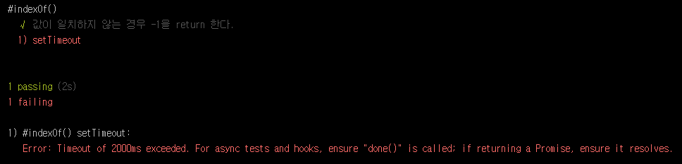

# Step 04. 비동기 처리

mocha에서의 비동기 처리는 매우 간단 명료합니다. 어떻게 보면 `동기 처리`보다 더욱 간단하죠.


## 동기 처리
<<<<<<< HEAD
`비동기 처리`에서 시작하기 앞서 `동기 처리`를 먼저 보겠습니다.
<br/>
일반적으로 우리가 mocha를 사용하는 것은 `동기 방식`입니다.
=======
`비동기 처리`에서 시작하기 앞서 `동기 처리`를 먼저 보겠습니다. 일반적으로 우리가 mocha를 사용하는 것은 `동기 방식`입니다.
>>>>>>> update step 04

```javascript
var chai = require('chai'),
    expect = chai.expect;


describe('#indexOf()', function () {
    it('값이 일치하지 않는 경우 -1을 return 한다.', function () {
        expect([1, 2, 3].indexOf(5)).to.equal(-1);
        expect([1, 2, 3].indexOf(3)).to.equal(2);
        expect([1, 2, 3].indexOf(0)).to.equal(-1);
    });
});
```

`동기 처리`에는 콜백이 없으며, 이 콜백을 생략하면 mocha는 자동으로 다음 테스틀 계속 진행하도록 되어있습니다.


## 비동기 처리

`비동기 처리`는 그저 콜백을 호출하기만 하면 됩니다. 콜백(일반적으로 `done()`이라 함.)을 추가함으로써 테스트(`it()` 또는 `test()`)가 완료하기 위해 이 함수가 호출될 때까지 기다리게 됩니다.
<<<<<<< HEAD
=======

>>>>>>> update step 04
<br/>
코드를 보도록 하겠습니다.

```javascript
var chai = require('chai'),
    expect = chai.expect;

describe('#indexOf()', function () {
    //비동기
    it('setTimeout', function (done) {
        setTimeout(function(){
            expect([1, 2, 3].indexOf(5)).to.equal(-1);
            expect([1, 2, 3].indexOf(3)).to.equal(2);
            expect([1, 2, 3].indexOf(0)).to.equal(-1);

            done();
        }, 1000);
    });
});
```


`setTimeout` 함수로 인해 1초 뒤에 실행되도록 되어있습니다. 여기서 `done()`을 호출을 하였기에 테스트가 종료되었다는 것을 알 수 있습니다.
만약 `done()` 호출이 없다면 오류를 발생하게 되어있습니다. 또한 기본 `timeout`인 `2000ms`가 지나가도 실패하게 되어있습니다.




## Hooks에서의 비동기 처리

우리는 이전 Tutorial인 [Step 03: Hooks](https://github.com/kdydesign/Mocha-Tutorial/tree/master/step03-Hooks)에서 전 후 처리에 대한 `Hooks`를 알아보았습니다.
이 `Hooks`에도 동일하게 `done()`을 콜백하여 `비동기 처리`를 할 수 있습니다.

```javascript
var chai = require('chai'),
    expect = chai.expect;

describe('#indexOf()', function () {
    var arr = [];

    beforeEach(function (done) {
        setTimeout(function () {
            arr = [1, 2, 3];
            done();
        }, 1500)
    });

    afterEach(function () {
        arr = [];
    });

    it('Asynchronous Hooks', function () {
        expect(arr.indexOf(5)).to.equal(-1);
        expect(arr.indexOf(3)).to.equal(2);
        expect(arr.indexOf(0)).to.equal(-1);
    });

});
```

위 코드를 보면 `beforeEach()`에서 1500ms 이후에 `arr`를 초기화하는 것을 볼 수 있습니다. 이처럼 `비동기 처리`는 테스트와 Hooks에 적용이 가능하며, 사용법 마저 매우 쉽습니다.
  
- - -

</br>

[Step 05: 외부 모듈 테스트](https://github.com/kdydesign/Mocha-Tutorial/tree/master/step04-Asynchronous)

