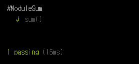

# 외부 모듈 테스트

어느 프로그램 언어나 마찮가지겠지만 JavaScript 역시 하나의 .js 파일에 코딩하진 않습니다. mocha 역시 하나의 `test.js` 파일에 모두 테스트 케이스를 적진 않죠.

이번 Tutorial에서는 외부 모듈을 불러와서 테스트하는 방법을 알아보겠습니다. 생각보다 분량이 적지만 매우 효율적인 방법이 될 것입니다.


## 외부 모듈 생성하기

앞으로 있을 Tutorial에서는 mocha를 `브라우저에서 구동 방법`을 배울텐데요. 이에 앞서 일단 우리는 `Node.js`기반에서 돌려보도록 하겠습니다.
일단 간단하게 `sum()`함수를 만들어 보도록 할께요. 명칭 그대로 합계를 내는 함수입니다. 파일명은 `ModuleSum`이라고 정의해 봅시다.

```javascript
module.exports = {
    sum: function (num1, num2) {
        return num1 + num2;
    }
};
```

매우 간단한 함수죠. 위에서 `브라우저에서 구동`하는 방법을 배운다는 건 이 부분이 약간 다르기 때문입니다.
우리는 `ModuleSum`을 `export`하였지만 `브라우저 구동`방식에서는 그저 `Function`만 생성하면 됩니다.
이미 `index.html`에서 `script`를 Import하기 때문이죠.

## 외부 모듈 불러오기

이제 외부 모듈인 `ModuleSum`이 생성되었습니다. 이 모듈을 불러와서 테스트만 진행하면 끝납니다.

`test.js`파일을 생성하고 코드를 작성합니다.

```javascript
var chai = require('chai'),
    moduleSum = require('./ModuleSum'),
    expect = chai.expect;

describe('#ModuleSum', function () {
    it("sum()", function () {
        expect(moduleSum.sum(1, 2)).to.equal(3);
        expect(moduleSum.sum(3, 2)).to.equal(5);
        expect(moduleSum.sum(5, 0)).to.equal(5);
    })
});
```

실행해 볼까요?




설명이 별로 필요하지 않는 코드군요. 

`require`로 이미 생성한 `ModuleSum`을 불러오고 적절한 테스트 케이스를 통해 테스트를 진행합니다.

사실 이 Tutorial을 쓸까말까 고민했었는데 누군가에게 도움이 되길 바라며 짤막하게 포스팅 해보았습니다.

다음 Tutorial에서는 아까 말한 `브라우저에서 구동 방법`을 진행하도록 하겠습니다.

- - - 

<br/>

[Step 06: 브라우저에서의 Mocha 지원](https://github.com/kdydesign/Mocha-Tutorial/tree/master/step02-chai)
 