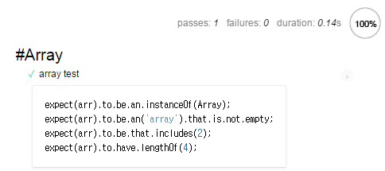
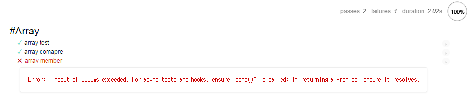

# Mocha 브라우저 구동

[Step 01: Hello World!](https://github.com/kdydesign/Mocha-Tutorial/tree/master/step01-Hello%20World!)부터 시작으로 지금까지 우리는 `$ mocha` 명령을 통해 터미널에서 실행하였습니다.
mocha는 터미널뿐만 아니라 `gulp`의 task를 통해 실행도 가능하지만, 이 밖에도 브라우저에서 구동되도록 지원하고 있습니다.
우리는 이번 Tutorial에서는 mocha를 `브라우저에서 구동`하는 방법을 알아보겠습니다.


## index.html

먼저 `html`파일을 생성하도록 하겠습니다. 추후에 이 페이지를 실행시켜 mocha를 구동할 것입니다.

```html
<!DOCTYPE html>
<html lang="ko">
<head>
    <meta charset="UTF-8">
    <title>Mocha Tests</title>

    <link rel="stylesheet" href="../node_modules/mocha/mocha.css">
</head>
<body>
<div id="mocha"></div>
<script src="../node_modules/mocha/mocha.js"></script>
<script src="../node_modules/chai/chai.js"></script>
<script>
    mocha.setup({
        ui: 'bdd',
        reporter: 'html'
    })
</script>

<!-- 테스트 코드 -->
<script src="test.js"></script>

<script>
    mocha.checkLeaks();
    mocha.run();
</script>
</body>
</html>
```

먼저 mocha에 필요한 `css`와 `mocha.ja` 그리고 `chai.js`파일을 불러왔습니다. 해당 Tutorial에서는 `node_modules`에 포함된 파일을 불러왔지만 `CDN`으로 불러올 수 있습니다.

`CDN`은 아래를 참고하세요.

> https://cdn.rawgit.com/mochajs/mocha/2.2.5/mocha.css
> https://cdn.rawgit.com/mochajs/mocha/2.2.5/mocha.js
> https://cdnjs.cloudflare.com/ajax/libs/chai/4.0.2/chai.min.js

이렇게 필요한 소스를 불러온 후 mocha 설정에 관련된 `setup`을 진행합니다. 그런 다음 테스트 스위트와 테스트 케이스가 포함된 `.js`파일을 로드합니다.

마지막으로 `onload` 인터페이스와 함께 `run()`을 통해 mocha를 실핼하게 되어있습니다. 우리는 아직 `test.js`를 정의하지 않았기 때문에 실행을 한다고 하더라고 결과가 나오지는 않습니다.


## test.js

이제 `index.html`파일이 준비되어 있으니 `test.js`를 정의하도록 하겠습니다.

```javascript
var expect = chai.expect;

describe('#Array', function () {
    var arr;

    beforeEach(function () {
        arr = [1, 2, 3, 4];
    });

    afterEach(function () {
        arr = [];
    });

    it("array test", function () {
        expect(arr).to.be.an.instanceOf(Array);
        expect(arr).to.be.an('array').that.is.not.empty;
        expect(arr).to.be.that.includes(2);
        expect(arr).to.have.lengthOf(4);
    });
});
```

터미널에서 실행할 때와 다른 점은 `chai.expect` 부분입니다. `브라우저 구동`할 때는 이미 `index.html`에 우리가 `chai`를 불러왔기 때문에 별도로 `require`하지 않아도 됩니다.

테스트의 내용을 잠깐 살펴보면 Array의 타입과 데이터가 존재하는지에 대한 몇 가지 테스트입니다.

이제 브라우저를 실행하면 결과가 출력됩니다.



터미널보다 훨씬 더 보기 편리하군요.

해당 테스트 케이스를 클릭하게 되면 테스트를 진행한 코드를 볼 수가 있습니다. 그리고 상단에는 `passes`, `failures`, `duration`을 확인할 수 있습니다.
테스트가 너무 짧은가요? 테스트 케이스를 더 추가하여 다시 확인해 보겠습니다.

아래 코드를 `test.js`에 이어서 작성합니다.

```javascript
it('array compare', function () {
    expect(arr).to.eql([1, 2, 3, 4]);
});

it('array member', function (done) {
    setTimeout(function () {
        expect(arr).to.have.members([4, 3, 2, 1]);
        done();
    }, 3000);
});
```

먼저 결과를 보겠습니다.



`array member`테스트의 경우 브라우저에도 `3000ms`뒤에 실행하는 것을 볼 수 있습니다. 그리고 [Step 04: 비동기 처리](https://github.com/kdydesign/Mocha-Tutorial/tree/master/step04-Asynchronous)에서 배운 비동기로 처리하였으며, `3000ms`후에 실행하기에 오류가 발생합니다.
발생한 오류에 대한 내용도 출력이 되는군요.


## 외부 모듈 불러오기

우리는 [Step 05: 외부 모듈 테스트](https://github.com/kdydesign/Mocha-Tutorial/tree/master/step05-Import%20Modules)을 통해 외부 모듈을 불러와서 테스트를 작성하였습니다. 
그리고 `브라우저 구동`에서 외부 모듈을 어떻게 불러오는지 대략적인 설명이 있었습니다. 그 내용을 자세하게 알아보겠습니다.

[Step 05: 외부 모듈 테스트](https://github.com/kdydesign/Mocha-Tutorial/tree/master/step05-Import%20Modules)에서 사용한 `ModuleSum.js`를 사용하겠습니다.

```javascript
function sum(num1, num2) {
    return num1 + num2;
}
```

동일하게 합계를 구하는 함수입니다. 하지만 다른점은 `export`를 하지 않았다는거죠. 단순한 `function`입니다.

이제 이 `ModuleSum.js`는 `index.html`에서 불러오도록 하겠습니다.

```html
<!-- //... -->
<div id="mocha"></div>
<script src="../node_modules/mocha/mocha.js"></script>
<script src="../node_modules/chai/chai.js"></script>

<script src="ModuleSum.js"></script>
<!-- //... -->
```

이제 불러온 `ModuleSum.js`를 가지고 테스트 케이스를 작성하겠습니다. `test.js`에 테스트 스위트를 추가해야겠군요.

```javascript
describe('#ModuleSum', function () {
    it('sum()', function () {
        expect(sum(1, 2)).to.eql(3);
    });
});
```

- - -

mocha의 `브라우저 구동`은 매우 다루기 쉽고 작성하기도 쉽습니다. `index.html`에 설정만 적당하게 잘 만들어 놓는다면 이보다 편한 것도 없죠.

그럼 mocha의 설정은 어떻게 하고 어떤 것들이 있는지 확인해보겠습니다.


<br/>

[Step 07: Options](https://github.com/kdydesign/Mocha-Tutorial/tree/master/step02-chai)